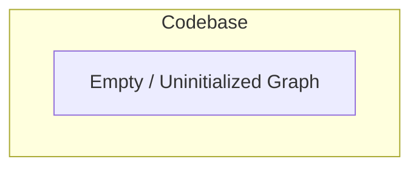

# ARCHITECTURE.md

## Overview

This document provides an architectural overview of the codebase based strictly on the provided dependency graph. 

> **Note:** The provided dependency graph is empty (`{}`). Consequently, no active modules, files, entities (classes or functions), or inter-component dependencies were detected in the analyzed scope.

---

## System Architecture Diagram

Below is the Mermaid.js diagram representing the current state of the codebase dependencies as reported by the input graph:

---

## Components & Modules

* **Files Identified:** 0
* **Modules/Packages:** None
* **External Dependencies:** None

---

## Core Entities & Interfaces

No classes, functions, interfaces, or execution paths are present in the provided dependency analysis.

---

## Data Flow & Dependencies

Because the graph contains no nodes or edges:
* There are no data flows to trace.
* There are no direct or indirect module dependencies.

---

## Architectural Recommendations

1. **Graph Generation Verification:** Ensure that the dependency extraction tool was pointed at the correct source root directory and that supported source files are present.
2. **Architecture Documentation Updates:** As source files, classes, and function calls are added to the codebase, re-run the dependency graph generator to populate this document with structural diagrams and module maps.